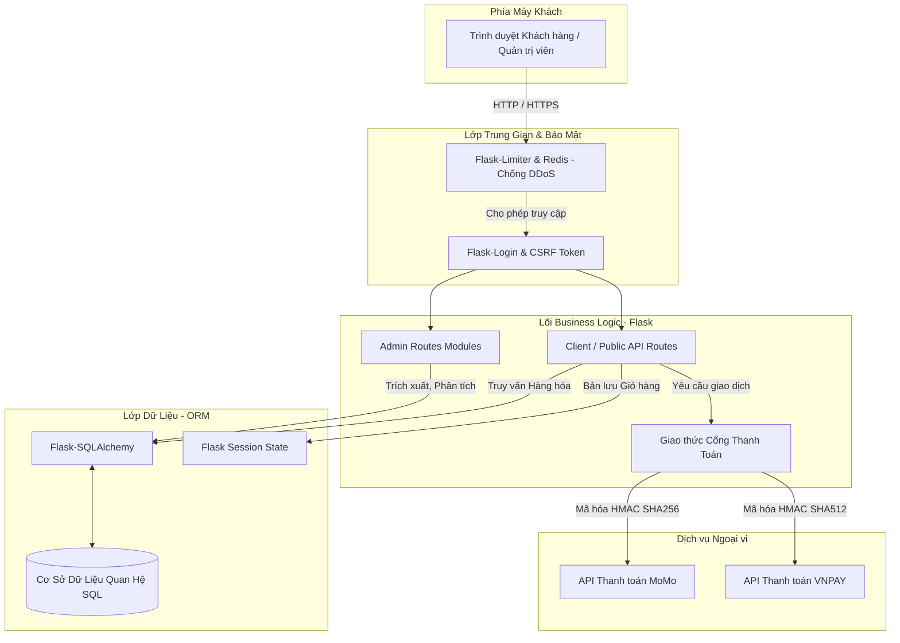
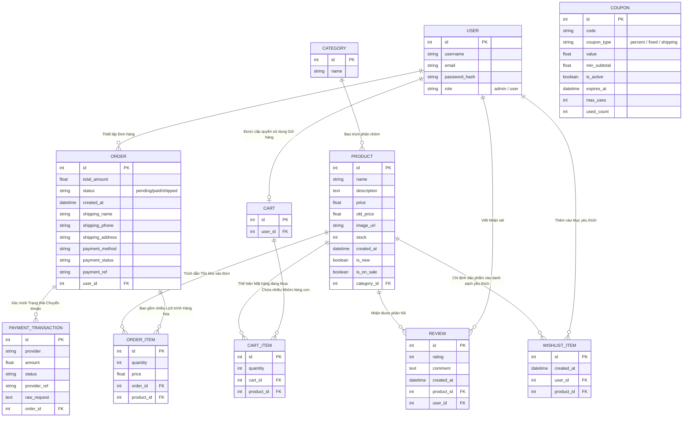

# BÁO CÁO CẤU TRÚC KỸ THUẬT VÀ PHÂN TÍCH HỆ THỐNG THƯƠNG MẠI ĐIỆN TỬ (UTH STORE)

Tài liệu này là một bản phân tích chuyên sâu toàn diện về nền tảng thương mại điện tử **UTH Store**. Tài liệu được biên soạn đặc biệt để phục vụ cho mục đích làm tài liệu thiết kế hệ thống, báo cáo đồ án khóa luận tốt nghiệp, đánh giá kiến trúc phần mềm và làm tài liệu hướng dẫn kỹ thuật cho các kỹ sư phát triển.

---

## 1. TỔNG QUAN DỰ ÁN VÀ NGHIỆP VỤ HỆ THỐNG

**UTH Store** là hệ thống mua sắm trực tuyến tập trung vào mặt hàng thời trang, được xây dựng bằng Python Framework (Flask) và cấu trúc cơ sở dữ liệu quan hệ (SQLite/SQLAlchemy).
Hệ thống giải quyết các bài toán thiết yếu của một trang bán hàng kỹ thuật số, bao gồm:
*   Trải nghiệm khách hàng xuyên suốt: Duyệt sản phẩm, tìm kiếm từ khóa, bộ lọc thông minh, đến việc lựa chọn hàng hóa bằng giỏ hàng tạm (session-based) và giỏ hàng vĩnh viễn (database-backed).
*   Chuyển đổi số thanh toán: Tích hợp hai cổng thanh toán tự động (MOMO, VNPAY) kết hợp với các hình thức truyền thống (COD, Chuyển khoản ngân hàng).
*   Công cụ Quản trị (Admin panel): Kiểm soát tình trạng đơn hàng, điều hành mã giảm giá, và mở rộng danh mục sản phẩm hoàn toàn tự động.

---

## 2. KIẾN TRÚC VÀ CÁC THÀNH PHẦN CÔNG NGHỆ CHÍNH

Hệ thống tuân thủ chặt chẽ kiến trúc Client-Server và triển khai theo mô hình MVC (Model-View-Controller) mở rộng thông qua Flask Framework:

*   **Backend & Routing:** Xây dựng trên nền tảng Python 3 với `Flask`. Quản lý các tuyến đường bằng Router, hàm xử lý dữ liệu và Business Logic (nghiệp vụ).
*   **Database Access Layer:** `SQLAlchemy` đóng vai trò ORM, tự động chuyển đổi đối tượng Python thành mã lệnh truy vấn SQL.
*   **View Layer (Giao diện):** `Jinja2` đóng vai trò Templating Engine, truyền dẫn dữ liệu động từ backend trộn với HTML/CSS/JS thuần để gửi trả lại Client.
*   **Security & Policy Layer:** `Flask-WTF` tạo mã CSRF Token bảo vệ truy cập. `Werkzeug.security` băm mật khẩu khách hàng một chiều (PBKDF2 SHA256). `Flask-Limiter` với `Redis` kiểm soát phòng ngừa tận gốc các tấn công DDoS.

### 2.1. Sơ Đồ Khối Kiến Trúc Tương Tác Hệ Thống (System Architecture)

---

## 3. PHÂN TÍCH CHI TIẾT KIẾN TRÚC TẬP TIN DỰ ÁN (FILE BY FILE REPORT)

Dưới đây là một phân tích sâu sát (Deep Dive) về mã nguồn và chức năng điều phối của từng tệp tin độc lập.

### 3.1. Tập tin <code>app.py</code> - Trung Tâm Điều Hành Ứng Dụng (Application Core)
Tập tin này có dung lượng tài nguyên lớn nhất, tham gia vận hành toàn bộ luồng request-response cycle của hệ thống.
*   **Khởi tạo ứng dụng & Cấu hình (Config):** Load file biến môi trường (`.env`), cấu hình Secret Key, chuỗi kết nối Database, HTTP-Only Cookie Session. Tại đây khởi tạo biến config môi trường đối trọng tích hợp Momo, VNPay và Ngân hàng.
*   **Logic Giỏ Hàng (Cart Logic):** Chứa các hàm `_session_cart_get`, `_get_or_create_user_cart`. Đây là khối nghiệp vụ cực kỳ hay: nếu chưa đăng nhập, sử dụng Guest Cart. Khi User làm tiến trình Register hoặc Guest Checkout, hệ thống sẽ gọi chuỗi logic "Cart Merge" nhằm đổ dữ liệu phiên sang CSDL thực để không làm mất sản phẩm vừa chọn. Xử lý thuật toán tồn kho (`product.stock`) để luôn giới hạn lượng sản phẩm khách được phép đặt.
*   **Bộ máy Khuyến Mãi (Coupon Engine):** Xử lý thuật toán khấu trừ các tệp mã cứng tĩnh (Static config) hoặc cấu hình động vào cơ cở dữ liệu. Thuật toán chiết khấu chia hàm phân rã ra: phần trăm giỏ (`percent`), trừ thẳng vào trị giá (`fixed`) và miễn phí giao vận (`shipping`).
*   **Thanh Toán (Payment Integrations):** Thực thi cấu hình chuẩn hóa định dạng giao dịch, khởi tạo Signature và checksum HMAC để đối chiếu thông tin trả ngược về phía Server của Momo và VNPay.
*   **Điều Hướng (Routing):** Tích hợp tất cả các nhánh URL như xem hàng `/products`, chi tiết sản phẩm `/product/<id>`, thanh toán `/checkout`, `/admin/*` quản lý dành riêng cho `current_user.role == 'admin'`. Khởi tạo hàm `sitemap_xml()` tự động tạo bản đồ cây Sitemap tối ưu Search Engine.

### 3.2. Tập tin <code>models.py</code> - Lớp Lưu Trữ và Ánh Xạ Đối Tượng (Database ORM)
Bộ gen định hình cách dữ liệu và con trỏ khóa ngoại (Foreign Key) móc nối với nhau, quy định hoàn toàn logic kiến trúc CSDL.
*   **User:** Quản lý người dùng, kế thừa tham số `UserMixin` hỗ trợ `Flask-Login`. Chứa các khóa ngoại mapping ngược lại `Cart`, `Order`, `Review`. Hệ quản trị cấp quyền được chia ngạch Role: `user` hoặc `admin`.
*   **Category & Product:** Cấu trúc danh mục và hàng hóa. Hỗ trợ trường thông tin `is_new`, `is_on_sale`, giá thực, giá gốc, URL hình ảnh trực quan, và số lượng quản lý kho (stock).
*   **Cart & CartItem:** Mối quan hệ master-detail liên kết 1-n, quy đinh giỏ hàng và danh mục bên trong, kết nối thẳng về tài khoản cá thể.
*   **Order, OrderItem, & PaymentTransaction:** Triển khai CSDL lưu lại vết ghi khi mua sắm. `Order` lưu điểm rơi địa chỉ và logic chốt đơn COD. `PaymentTransaction` dùng riêng cho luồng Giao dịch số chứa tham chiếu chuỗi Json phản hồi thô (raw response) lưu dự phòng kế toán và kiểm kê trạng thái tiền tệ.
*   **Coupon:** Cấu trúc quy định biến số điều kiện mã giảm giá, giới hạn ngân sách tối thiểu (`min_subtotal`), tổng hạn mức (`max_uses`).
*   **Review:** Phân tích logic người bình luận bắt buộc phải đi với hệ tham chiếu khoá ngoại về sản phẩm.

### 3.3. Tập tin <code>extensions.py</code> - Mảnh Ghép Mở Rộng Hệ Thống
Mô hình Circular Dependency của Python bắt buộc phải sử dụng Singleton extension.
*   Tập tin định sinh ra biến `db = SQLAlchemy()` và quản lý đăng nhập `login_manager = LoginManager()`. Kỹ thuật này giúp phân tách phần khai báo module ra khỏi Controller `app.py`, giữ cho mã nguồn có nền tảng module hóa cao, và tránh tình trạng xoay vòng import không thể tải file.

### 3.4. Tập tin <code>seed.py</code> - Tiến Trình Tự Động Sinh Dữ Liệu Tồn Kho
*   Một nền tảng cần dữ liệu ngay từ lúc báo cáo đánh giá. Tập tin này chứa mảng danh sách cứng (Hard-coded array) về những thư mục thời trang như áo thun, áo khoác, quần jean...
*   Kỹ thuật `db.session.add_all()` và `db.session.commit()` tạo lập các sản phẩm nguyên mẫu thử nghiệm cũng như các mật khẩu tài khoản quản trị `admin123` được hash tự động phục vụ nhu cầu kiểm thử (Unit Testing, QA Testing) và đánh giá độ chịu tải.

### 3.5. Tập tin <code>requirements.txt</code> - Cấu Trúc Khung Dependencies
Bản kê khai các bộ công cụ phát triển phần mềm được kiểm duyệt kỹ càng:
*   `Flask==3.0.3` và `Werkzeug==3.0.3`: Xương sống của API HTTP.
*   `Flask-SQLAlchemy==3.1.1` cùng `SQLAlchemy==2.0.31`: Quản trị tương tác CSDL mà không dùng câu lệnh string SQL thuần phục tùng chuẩn mực Clean Code.
*   `Flask-Limiter==3.8.0` kết hợp `redis==7.4.0`: Cơ chế khống chế bộ nhớ nhằm cân bằng mạng chống Request Spam.
*   `Flask-WTF`, `requests`, `python-dotenv`: Middleware kiểm soát an toàn và bảo mật, giao tiếp External Restful API.

---

## 4. PHÂN TÍCH LỚP GIAO DIỆN HIỂN THỊ (TEMPLATES LAYER)

Thư mục <code>/templates</code> chứa các giao diện được phân tách bằng ngữ pháp Jinja2 độc bản, nhằm tái sử dụng mã (Reusability).

*   **base.html:** Giao diện gốc (Master layout). Bao gồm cấu trúc `<!DOCTYPE html>`, chứa thẻ gọi thư viện CSS Bootstrap, Javascript, jQuery. Các thẻ meta header thông dụng. Các `<Block>` cấu trúc Navigation Bar, Footer, xử lý hiệu ứng Flashing Messages đều được cấy trong tập tin này.
*   **index.html:** Điểm rơi trang chủ hệ thống. Kế thừa `base.html`, gọi thẻ vòng lặp hiển thị mảng sản phẩm tiêu biểu theo độ Mới (`is_new`) và hệ số Chiết khấu cao (`is_on_sale`).
*   **products.html (Trang danh mục sản phẩm):** Nơi xử lý trực tiếp giao diện phân trang (Pagination), chứa cột trái hiển thị Sidebar đa tầng lọc từ Danh sách Category, Range giá trị, và Khuyến mãi.
*   **product-detail.html:** Thể hiện trực quan chi tiết thiết kế hàng hóa, điều phối nút "Thêm vào giỏ" đi kèm ô chọn Số lượng tồn. Module phân nhánh giao tiếp thẻ hiển thị "Bình luận/Review". Chứa logic xác thực nếu Guest chưa đăng nhập thì không mở nút Bình luận để chống Spam.
*   **cart.html:** Thể hiện logic toán học frontend (Giá tiền, Thuế phí, Giảm giá coupon, Tổng doanh thu phụ/chính) của bảng danh sách hàng. Khả năng thiết lập tương tác xóa mềm thông qua AJAX.
*   **checkout.html:** Nơi tập hợp mọi form mẫu chứa thông tin định tuyến giao nhận địa chỉ, có tích hợp kỹ thuật CSRF Hidden Field đảm bảo luồng Data chuẩn. Hiển thị module Chọn loại hình thanh toán Bank Transfer / Stripe / VNPay / MoMo tương ứng.
*   **admin.html / my-orders.html:** Giao diện điều phối luồng quy trình của Quản trị Hệ thống. Giao diện dạng Bảng (Table Data), ứng dụng màu sắc trạng thái (Status Colors) cho việc điều phối tiến trình đơn hàng Trạng thái hoàn thiện (Shipped / Delivered) một cách trực quan tối đa.
*   **login.html & profile.html:** Cơ chế bảo quản trạng thái người dùng cá nhân (Session identity). Giao diện đổi thiết lập cá nhân và truy vết mã phiếu giảm giá tự vận hành.

---

## 5. SƠ ĐỒ THỰC THỂ KẾT HỢP DỮ LIỆU CHUYÊN SÂU (ER DIAGRAM)

Cấu trúc định tuyến kết nối quan hệ mô tả cơ sở hạ tầng các thực thể sống trong dự án:

---

## 6. KHÍA CẠNH BẢO MẬT & TỐI ƯU HIỆU SUẤT TRONG KIẾN TRÚC

1.  **Vệ sinh dữ liệu đầu vào (Input Sanitization)**: Khống chế Injection thông qua ORM tĩnh hóa các chuỗi string thành định dạng bảo vệ. Hàm `secure_filename()` của Werkzeug khử trùng tên tập tin (XSS và lổ hổng thư mục Path Traversal).
2.  **Định tuyến luồng mã hóa PBKDF2**: Không lưu trực tiếp chữ và số ở CSDL mà tạo mã hàm khối Hash 256 giúp bảo mật mật khẩu. Khi rò rỉ dữ liệu Database cũng không thể khai thác quy ngược trở lại plain-text.
3.  **Cross-Site Request Forgery (CSRF) Tokens**: Hệ thống Flask-WTF sẽ phát hành chuỗi phiên độc nhất cho mảng dữ liệu trình duyệt qua AJAX. Các hình thức khai thác thông qua link rác gắn mã độc để chèn đơn hàng hoàn toàn bị khoá mã.
4.  **Kiểm soát Tài nguyên mạng (DDoS Mitigation)**: Limiter lưu dữ liệu IP trên nền tảng In-Memory Data của Redis đảm bảo chi phí truy xuất mili-giây.

---

## 7. KẾT LUẬN

Hệ thống UTH Store là một nguyên bản mạnh mẽ, mang đặc thù một cơ cấu hoàn chỉnh trong hệ sinh thái ứng dụng Python Backend. Trục định tuyến mạch lạc kết hợp tính năng bảo mật toàn diện cho phép nền tảng dễ dàng trở thành tư liệu mẫu cao cấp cho mọi công tác nghiên cứu, luận văn hay phát triển thành Commercial System chính thống. Blueprint cấu trúc mở thuận tiện để tiếp tục triển khai Dockerization và Micro-service hóa trong lộ trình tương lai.
